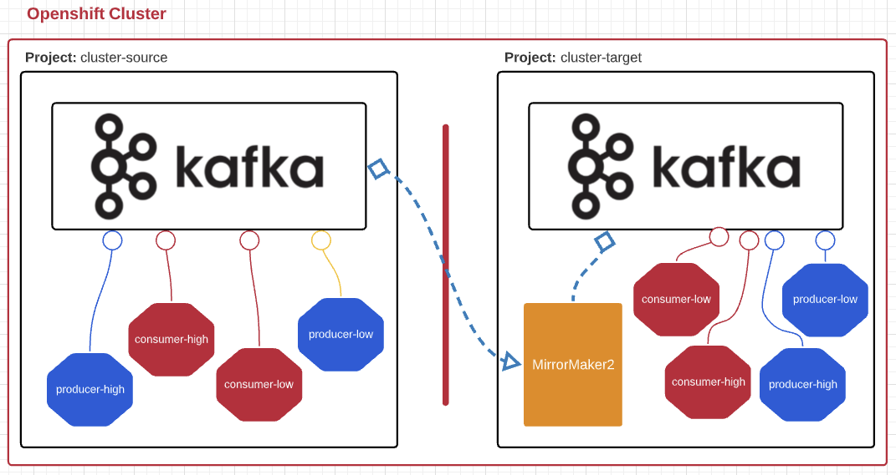
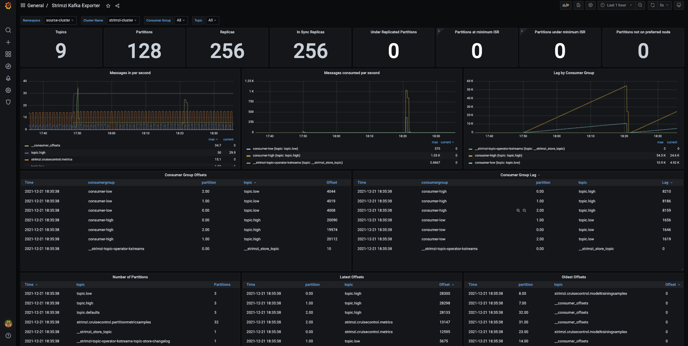

# Migrating AMQ Streams from Openshift 3.11 to 4.7

[quote, AMQS Product Docs]
AMQ Streams simplifies the process of running Apache Kafka in an OpenShift cluster.

In this post I will show how to migrate an AMQ Stream cluster between OCP environments(ie: OCP3.11 to OCP4.8) using MirrorMaker2; a Kafka component used to replicate data between two or more active Kafka clusters, within or across data centers. 

We will begin with an overview of the two clusters(kafka-source and kafka-target), the components deployed, then show how to set up AMQ Stream v1.8, Prometheus(metrics collection), and Grafana(monitoring and alerting). All these components are deployed via a single helm chart with possibility of selectively installing specific resources(amqs, mirrormaker, grafana). 

## Environment Overview

This guide uses two namespaces within the same Openshift cluster to mimic cross OCP deployments migration. The approach would be roughly the same if for instance we were looking to migrate a Strimzi cluster from OCP3 to OCP4. An obvious change would be using external routes when referencing source brokers; rather than services in our case.

### Architecture

### Components, CRDs deployed

We will be deploying AMQ Streams v1.8 for this demo.

* CRDs
** to grant OCP the capability to read and understand Strimzi resource manifests;
* Cluster operator to manage the Kafka cluster
** watches over the strimzi cluster components for change reconciliation
* Kafka (including ZooKeeper, Entity Operator, Kafka Exporter, and Cruise Control)
** https://access.redhat.com/documentation/en-us/red_hat_amq/2021.q3/html-single/using_amq_streams_on_openshift/index#type-KafkaSpec-reference[Follow this link for more]
* KafkaMirrorMaker2
** handles cluster mirroring activities;
** deployed on the target cluster
* Prometheus
** used for metrics collection
* Grafana -- v7.5.11
** used for displaying metrics on dashboards and alerting
** deployed in both clusters;
** we could use PrometheusRule and Alertmanager to send alerts as well.

## Implementation

This guide will utilize a 2 nodes Openshift 4.8 cluster.

IMPORTANT: You need _cluster-admin_ role on the cluster to execute most of the tasks described in this guide.

### Cluster info, tools used

* 2 nodes OpenShift 4.8 Cluster
** The ideal setup should be at least 3 worker nodes.
* kubernetes v1.21.0
* oc v4.8.2
* AMQ Streams v1.8
* Grafana v7.5.11
* projects/namespaces: source-cluster, target-cluster
* helm v3.6.2

Because this demo uses multiple components to setup the entire cluster, we will use the concept of sub-chart whereby we have modules for:
* user-workload-monitoring -- creates the user-workload monitoring enabler ConfigMap.
** this chart is optional; only apply it if user-workload monitoring has not been enabled.
* strimzi-crd -- installs the CRDs and ClusterRoles
* cluster-operator -- the kafka cluster operator
* kafka -- sets up the kafka cluster components
* strimzi-monitoring -- for observing and alerting on the kafka cluster
* sample-apps -- they act as producers and consumers who publish and subscribe to topics (topic.high, topic.low, topic.default)
* During the entirety of this guide, the root folder of the repo is assumed to be the working directory.

### Part1: Setting up the source kafka cluster

#### Enable user workload monitoring -- If not enabled

* Check if user-workload monitoring is enabled

[source,bash]
----
oc -n openshift-user-workload-monitoring get pods
----

** If enabled, the output should look like below table

[source,text]
----
NAME                                 READY   STATUS    RESTARTS   AGE
prometheus-operator-fb9dcc6c-7q4bk   2/2     Running   0          62s
prometheus-user-workload-0           5/5     Running   1          59s
thanos-ruler-user-workload-0         3/3     Running   0          55s
----

* If output don't match the table above, apply the user-workload-monitoring sub-chart
+
[source,bash]
----
# Install the cluster-operator sub-chart
helm upgrade --install user-workload-monitoring amq-streams-chart/charts/user-workload-monitoring --namespace ${WORK_NAMESPACE}
# list pods
oc -n openshift-user-workload-monitoring get pod
----
+
** Output should look like above table.
* https://docs.openshift.com/container-platform/4.8/monitoring/enabling-monitoring-for-user-defined-projects.html[Click here for more on user-workload monitoring].

*Progress Check:*
* We should have the following charts installed
[source,bash]
----
helm list
NAME                            NAMESPACE       REVISION        UPDATED                                 STATUS          CHART                           APP VERSION 
user-workload-monitoring        source-cluster  1               2021-12-20 19:43:49.740817957 +0000 UTC deployed        user-workload-monitoring-1.0.0  1.8    
----

#### Create the source-cluster namespace

[source,bash]
----
# Source Cluster Namespace: source-cluster
oc create namespace source-cluster -o yaml
export WORK_NAMESPACE="source-cluster"
oc project ${WORK_NAMESPACE}
----

#### Deploy the strimzi CRDs and ClusterRoles

IMPORTANT: This step is required and only execute once per OpenShift cluster

[source,bash]
----
# Install the strimzi-crd sub-chart
helm upgrade --install strimzi-crd amq-streams-chart/charts/strimzi-crd --namespace ${WORK_NAMESPACE}
----

#### Deploy the cluster operator
* The cluster-operator CRDs are setup within a subchart named cluster-operator
* workdir: parent directory of the root helm chart
* you could add --dry-run to preview actions taken by helm
[source,bash]
----
# Install the cluster-operator sub-chart
helm upgrade --install cluster-operator amq-streams-chart/charts/cluster-operator --namespace ${WORK_NAMESPACE}
----
* The output should look like below table
[source,bash]
----
oc --namespace ${WORK_NAMESPACE} get pods
# Output
NAME                                        READY   STATUS    RESTARTS   AGE
strimzi-cluster-operator-7447d98d84-xcqdk   1/1     Running   0          2m1s
----
+

*Progress Check:*
* We should have the following charts installed
[source,bash]
----
# command
helm list
# output
NAME                            NAMESPACE       REVISION        UPDATED                                 STATUS          CHART                           APP VERSION
cluster-operator                source-cluster  1               2021-12-20 19:21:41.675028842 +0000 UTC deployed        cluster-operator-1.0.0          1.8        
user-workload-monitoring        source-cluster  1               2021-12-20 19:43:49.740817957 +0000 UTC deployed        user-workload-monitoring-1.0.0  1.8          
----

#### Deploy Kafka its components
** The cluster-operator must be deployed first
** The kafka components are declared within a sub-chart named kafka-components.

[source,bash]
----
# Apply the kafka sub-chart to deploy kafka and its components
helm upgrade --install strimzi-cluster amq-streams-chart/charts/kafka --namespace ${WORK_NAMESPACE}

----
* After about 5min, the output should look like below table
** If you don't see below output, troubleshoot by:
*** making sure you have enough resources(cpu, memory) on the nodes
*** `oc describe` the the sts, deployment, pods; you might find some indicators.
+
[source,bash]
----
# list pods
oc --namespace ${WORK_NAMESPACE} get pods
# output
NAME                                               READY   STATUS    RESTARTS   AGE
strimzi-cluster-cruise-control-84c5985b85-q2wxm    2/2     Running   0          82s
strimzi-cluster-entity-operator-8647fb6fbb-4ls9b   3/3     Running   0          17m
strimzi-cluster-kafka-0                            1/1     Running   0          19m
strimzi-cluster-kafka-1                            1/1     Running   0          19m
strimzi-cluster-kafka-exporter-dccf6c7-hcx9s       0/1     Running   0          30s
strimzi-cluster-operator-74574b6484-rcxdm          1/1     Running   0          100s
strimzi-cluster-zookeeper-0                        1/1     Running   0          21m
strimzi-cluster-zookeeper-1                        1/1     Running   0          20m
----

*Progress Check:*
* We should have the following charts installed
[source,bash]
----
# command
helm list
# output
NAME                            NAMESPACE       REVISION        UPDATED                                 STATUS          CHART                           APP VERSION
cluster-operator                source-cluster  1               2021-12-20 19:21:41.675028842 +0000 UTC deployed        cluster-operator-1.0.0          1.8           
strimzi-cluster                 source-cluster  5               2021-12-20 20:37:44.642093 -0600 CST    deployed        kafka-1.0.0                     1.8              
user-workload-monitoring        source-cluster  1               2021-12-20 19:43:49.740817957 +0000 UTC deployed        user-workload-monitoring-1.0.0  1.8         
----

#### Deploy monitoring resources for dashboards and alerts

*Prerequisites:*

* User workload monitoring must be enabled before attempting to deploy the monitoring resources for the strimzi cluster. 
* I have added the workload monitoring enabler subchart.
* In `amq-streams-chart/charts/strimzi-monitoring/examples/metrics/grafana-dashboards/`, replace all instances of `${DS_PROMETHEUS}` by `Prometheus`.

[source,bash]
----
# Replace ${DS_PROMETHEUS} by the data source name: Prometheus
# Apply the strimzi-monitoring sub-chart
helm upgrade --install strimzi-monitoring amq-streams-chart/charts/strimzi-monitoring --namespace ${WORK_NAMESPACE}
----
* If all goes well, the output should look like below table
+
[source,bash]
----
# list pods
oc --namespace ${WORK_NAMESPACE} get pods
# Output
NAME                                               READY   STATUS    RESTARTS   AGE
grafana-59cb86f8b4-mn54z                           1/1     Running   0          73s
strimzi-cluster-cruise-control-84c5985b85-q2wxm    2/2     Running   4          3h
strimzi-cluster-entity-operator-8647fb6fbb-4ls9b   3/3     Running   0          3h16m
strimzi-cluster-kafka-0                            1/1     Running   0          3h18m
strimzi-cluster-kafka-1                            1/1     Running   0          3h18m
strimzi-cluster-kafka-exporter-dccf6c7-hcx9s       1/1     Running   0          179m
strimzi-cluster-operator-74574b6484-rcxdm          1/1     Running   0          3h
strimzi-cluster-zookeeper-0                        1/1     Running   0          3h20m
strimzi-cluster-zookeeper-1                        1/1     Running   0          3h19m
----
+
* Also look at the grafana po logs to confirm there are no errors;
** all log records should show `lvl=info` or `lvl=warn`; otherwise you need to resolve whatever error the logs print.
+
[source,text]
----
t=2021-12-20T23:22:20+0000 lvl=info msg="New state change" logger=alerting.resultHandler ruleId=5 newState=no_data prev state=unknown
t=2021-12-20T23:22:21+0000 lvl=warn msg="Could not render image, no image renderer found/installed. For image rendering support please install the grafana-image-renderer plugin. Read more at https://grafana.com/docs/grafana/latest/administration/image_rendering/" logger=rendering
t=2021-12-20T23:22:21+0000 lvl=info msg="Executing slack notification" logger=alerting.notifier.slack ruleId=5 notification=Slack
t=2021-12-20T23:22:21+0000 lvl=info msg="Uploading to slack via file.upload API" logger=alerting.notifier.slack
t=2021-12-20T23:22:30+0000 lvl=info msg="New state change" logger=alerting.resultHandler ruleId=7 newState=ok prev state=unknown
t=2021-12-20T23:22:30+0000 lvl=info msg="New state change" logger=alerting.resultHandler ruleId=11 newState=pending prev state=unknown
t=2021-12-20T23:22:30+0000 lvl=info msg="New state change" logger=alerting.resultHandler ruleId=10 newState=ok prev state=unknown
t=2021-12-20T23:22:30+0000 lvl=info msg="Database locked, sleeping then retrying" logger=sqlstore error="database is locked" retry=0
t=2021-12-20T23:22:40+0000 lvl=info msg="New state change" logger=alerting.resultHandler ruleId=9 newState=ok prev state=unknown
----
+
* After verifying there are no errors in the grafana pod logs, grab the *grafana* route and open it via a browser.
** Default username and password is `admin`; you may change it by passing values during helm install command.
* Below represent what the Kafka dashboard might look like.

Now that we've setup our source kafka cluster, let's deploy some sample apps.

*Progress Check:*
* We should have the following charts installed
[source,bash]
----
# command
helm list
# output
NAME                            NAMESPACE       REVISION        UPDATED                                 STATUS          CHART                           APP VERSION
cluster-operator                source-cluster  1               2021-12-20 19:21:41.675028842 +0000 UTC deployed        cluster-operator-1.0.0          1.8              
strimzi-cluster                 source-cluster  5               2021-12-20 20:37:44.642093 -0600 CST    deployed        kafka-1.0.0                     1.8        
strimzi-monitoring              source-cluster  14              2021-12-20 20:23:51.813166 -0600 CST    deployed        strimzi-monitoring-1.0.0        1.8        
user-workload-monitoring        source-cluster  1               2021-12-20 19:43:49.740817957 +0000 UTC deployed        user-workload-monitoring-1.0.0  1.8    
----

#### Deploying sample apps to test our cluster

We have the following topics, we will use them to publish data to the cluster.

[source,bash]
----
# command
oc --namespace ${WORK_NAMESPACE} get kt
# output
NAME                                                                                               CLUSTER           PARTITIONS   REPLICATION FACTOR   READY
consumer-offsets---84e7a678d08f4bd226872e5cdd4eb527fadc1c6a                                        strimzi-cluster   50           2                    True
strimzi-store-topic---effb8e3e057afce1ecf67c3f5d8e4e3ff177fc55                                     strimzi-cluster   1            2                    True
strimzi-topic-operator-kstreams-topic-store-changelog---b75e702040b99be8a9263134de3507fc0cc4017b   strimzi-cluster   1            2                    True
strimzi.cruisecontrol.metrics                                                                      strimzi-cluster   5            2                    True
strimzi.cruisecontrol.modeltrainingsamples                                                         strimzi-cluster   32           2                    True
strimzi.cruisecontrol.partitionmetricsamples                                                       strimzi-cluster   32           2                    True
topic.defaults                                                                                     strimzi-cluster   5            2                    True
topic.high                                                                                         strimzi-cluster   3            2                    True
topic.low                                                                                          strimzi-cluster   3            2                    True
----

. Deploy the producers
+
[source,bash]
----
# Install the chart, you could play the Deployment env variables for increase data ingestion volume and rate
helm upgrade --install producers sample-apps/producers --namespace ${WORK_NAMESPACE}
# List the pods, you should see 3 producer-high pods, and 3 producer-low pods
oc --namespace ${WORK_NAMESPACE} get pods -l 'app in (producer-high,producer-low)'
# output
NAME                             READY   STATUS    RESTARTS   AGE
producer-high-56bbb4d7fb-djb68   1/1     Running   0          14m
producer-high-56bbb4d7fb-g5s9c   1/1     Running   0          14m
producer-high-56bbb4d7fb-mfhlx   1/1     Running   0          14m
producer-low-5f5c466884-2m8qg    1/1     Running   0          20m
producer-low-5f5c466884-qnphk    1/1     Running   0          20m
producer-low-5f5c466884-rzdc4    1/1     Running   0          20m
----
+
Grafana(Kafka Exporter Dashboard) as data is getting ingested.
+

+
*Progress Check:*
+
* We should have the following charts installed
+
[source,bash]
----
# command
helm list
# output
NAME                            NAMESPACE       REVISION        UPDATED                                 STATUS          CHART                           APP VERSION
cluster-operator                source-cluster  1               2021-12-20 19:21:41.675028842 +0000 UTC deployed        cluster-operator-1.0.0          1.8            
producers                       source-cluster  4               2021-12-20 21:04:16.485084 -0600 CST    deployed        producers-1.0.0                 1.8        
strimzi-cluster                 source-cluster  5               2021-12-20 20:37:44.642093 -0600 CST    deployed        kafka-1.0.0                     1.8        
strimzi-monitoring              source-cluster  14              2021-12-20 20:23:51.813166 -0600 CST    deployed        strimzi-monitoring-1.0.0        1.8        
user-workload-monitoring        source-cluster  1               2021-12-20 19:43:49.740817957 +0000 UTC deployed        user-workload-monitoring-1.0.0  1.8   
----
+
. Deploy the consumers
+
[source,bash]
----
# Install the chart, you could play the Deployment env variables for increase data ingestion volume and rate
helm upgrade --install consumers sample-apps/consumers --namespace ${WORK_NAMESPACE}
# List the pods, you should see 3 consumer-high pods, and 3 producer-low pods
oc --namespace ${WORK_NAMESPACE} get pods -l 'app in (consumer-high,consumer-low)'
# output
NAME                            READY   STATUS    RESTARTS   AGE
consumer-high-7b875455d-pd8j9   1/1     Running   0          19s
consumer-high-7b875455d-tqg55   1/1     Running   0          19s
consumer-high-7b875455d-xwpff   1/1     Running   0          19s
consumer-low-78865b55cb-c8xqv   1/1     Running   0          19s
consumer-low-78865b55cb-nnr8d   1/1     Running   0          19s
consumer-low-78865b55cb-tstq7   1/1     Running   0          19s
----
+
Grafana(Kafka Exporter Dashboard) as data is ingested and consumed.
+
** Note the `Consumer Group Lag` panel, there you can see the consumer groups our consumers apps have using.
+

+
*Progress Check:*
+
* We should have the following charts installed
+
[source,bash]
----
# command
helm list
# output
NAME                            NAMESPACE       REVISION        UPDATED                                 STATUS          CHART                           APP VERSION
cluster-operator                source-cluster  1               2021-12-20 19:21:41.675028842 +0000 UTC deployed        cluster-operator-1.0.0          1.8        
consumers                       source-cluster  1               2021-12-20 21:28:44.018332 -0600 CST    deployed        consumers-1.0.0                 1.8        
producers                       source-cluster  4               2021-12-20 21:04:16.485084 -0600 CST    deployed        producers-1.0.0                 1.8        
strimzi-cluster                 source-cluster  5               2021-12-20 20:37:44.642093 -0600 CST    deployed        kafka-1.0.0                     1.8        
strimzi-monitoring              source-cluster  14              2021-12-20 20:23:51.813166 -0600 CST    deployed        strimzi-monitoring-1.0.0        1.8        
user-workload-monitoring        source-cluster  1               2021-12-20 19:43:49.740817957 +0000 UTC deployed        user-workload-monitoring-1.0.0  1.8    
----

### Part2: Setting up the target kafka cluster

#### Create the target-cluster namespace

[source,bash]
----
# Target Cluster Namespace: source-cluster
oc create namespace target-cluster -o yaml
export WORK_NAMESPACE="target-cluster"
oc project ${WORK_NAMESPACE}
----

#### Deploying all the remaining components

Follow the same steps in *Part1* to setup the target-cluster:
* The strimzi-crd sub-chart is not required here; its installation is cluster-wide.

. Apply the cluster-operator sub-chart
+
[source,bash]
----
helm upgrade --install cluster-operator amq-streams-chart/charts/cluster-operator --namespace ${WORK_NAMESPACE}
# check cluster-operator pod is running
oc --namespace "${WORK_NAMESPACE}" get pods
# output
NAME                                        READY   STATUS    RESTARTS   AGE
strimzi-cluster-operator-7447d98d84-7cf2b   1/1     Running   0          66s
----
+
. Apply the kafka sub-chart
+
[source,bash]
----
helm upgrade --install kafka amq-streams-chart/charts/kafka --namespace ${WORK_NAMESPACE}
# check cluster-operator pod is running
oc --namespace "${WORK_NAMESPACE}" get pods
# output
NAME                                              READY   STATUS    RESTARTS   AGE
strimzi-cluster-cruise-control-84c5985b85-2j6tc   2/2     Running   0          7m35s
strimzi-cluster-entity-operator-b76d478c8-b8rhm   3/3     Running   0          8m36s
strimzi-cluster-kafka-0                           1/1     Running   0          10m
strimzi-cluster-kafka-1                           1/1     Running   0          10m
strimzi-cluster-kafka-exporter-dccf6c7-x2x95      1/1     Running   0          6m44s
strimzi-cluster-operator-7447d98d84-7cf2b         1/1     Running   0          13m
strimzi-cluster-zookeeper-0                       1/1     Running   0          11m
strimzi-cluster-zookeeper-1                       1/1     Running   0          11m
----
+
. Apply the strimzi-monitoring sub-chart
+
[source,bash]
----
helm upgrade --install strimzi-monitoring amq-streams-chart/charts/strimzi-monitoring --namespace ${WORK_NAMESPACE}
# grab grafana route to access monitoring dashboard
oc --namespace ${WORK_NAMESPACE} get route
# output
NAME                                       HOST/PORT                                                                                                PATH   SERVICES                                   PORT 
grafana                                    grafana-target-cluster.apps.cluster-ceda.ceda.sandbox1278.opentlc.com                                           grafana                                    grafana  
strimzi-cluster-kafka-external-0           strimzi-cluster-kafka-external-0-target-cluster.apps.cluster-ceda.ceda.sandbox1278.opentlc.com                  strimzi-cluster-kafka-external-0           9093
strimzi-cluster-kafka-external-1           strimzi-cluster-kafka-external-1-target-cluster.apps.cluster-ceda.ceda.sandbox1278.opentlc.com                  strimzi-cluster-kafka-external-1           9093
strimzi-cluster-kafka-external-bootstrap   strimzi-cluster-kafka-external-bootstrap-target-cluster.apps.cluster-ceda.ceda.sandbox1278.opentlc.com  
----
+
* Default username and password is `admin`.
* If all goes as expected, you should see below diagram
image:images/kafka-target-cluster.png[grafana target cluster]

*Progress Check:*
+
* We should have the following charts installed
+
[source,bash]
----
# command
helm list
# output
NAME                    NAMESPACE       REVISION        UPDATED                                 STATUS          CHART                           APP VERSION
cluster-operator        target-cluster  1               2021-12-21 12:24:08.345199 -0600 CST    deployed        cluster-operator-1.0.0          1.8        
kafka                   target-cluster  1               2021-12-21 12:26:18.36022 -0600 CST     deployed        kafka-1.0.0                     1.8        
strimzi-monitoring      target-cluster  1               2021-12-21 12:38:34.450056 -0600 CST    deployed        strimzi-monitoring-1.0.0        1.8          
----

### Part3: Deploying MirrorMaker2 to enable cluster mirroring

This deployment follows the one-way migration approach whereby the replication process flows in one direction: source-to-target.

#### Architecture Overview
image:images/mirror-maker2.png[mirror-maker-2 one way replication]

#### Deploy the MirrorMaker2 instance

IMPORTANT: MirrorMaker2 should be deployed alongside a running target Kafka cluster.

* This MM2 instance is setup in an active/passive mod; meaning mirrored data flows in one direction: source to target.
* The MM2 instance is also setup to begin replication from the earliest message and work its way towards the latest message.

[source,bash]
----
# Apply the mirror-maker2 sub-chart
helm upgrade --install mirror-maker2 mirror-maker2/ --namespace ${WORK_NAMESPACE}
# list the pods to confirm there is a mirrormaker2 pod
oc --namespace ${WORK_NAMESPACE} get pods

----

